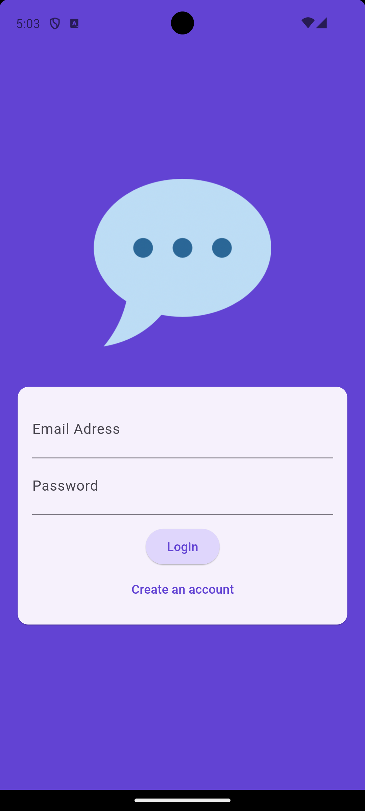
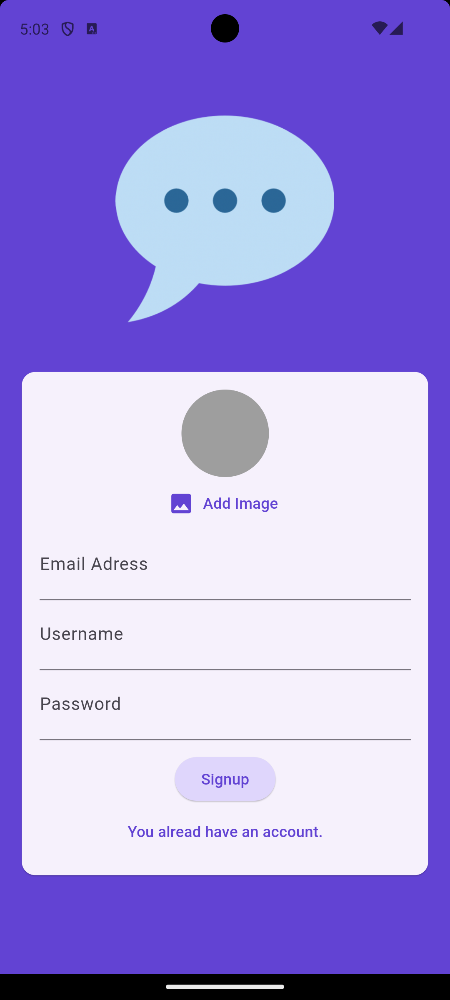
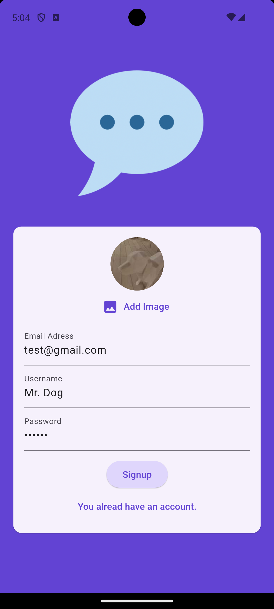
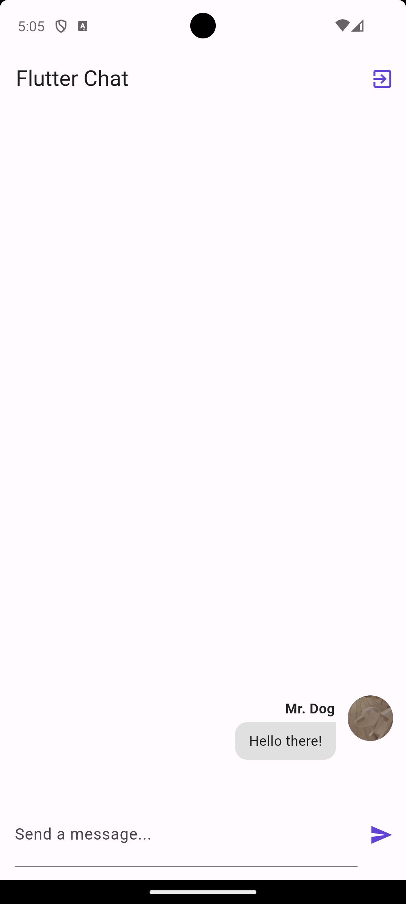
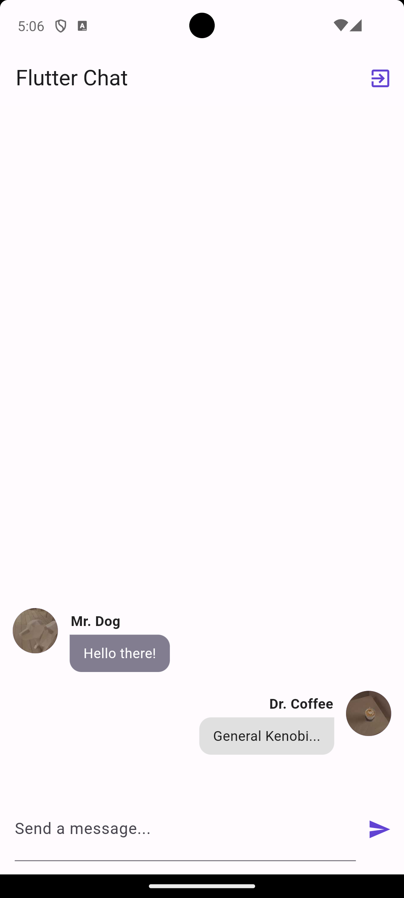
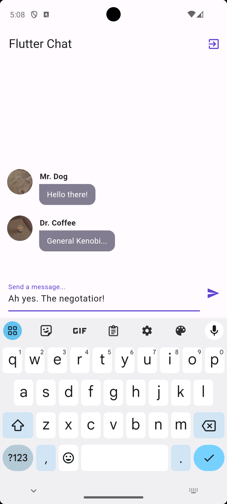
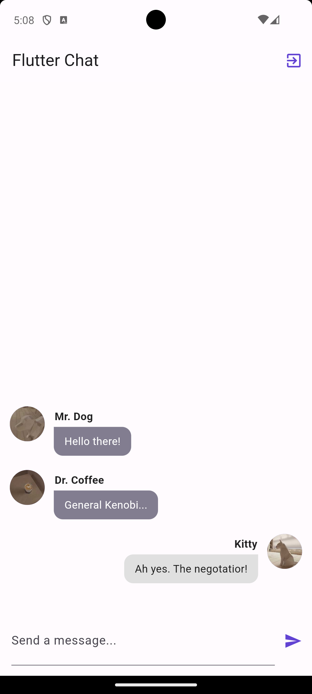

# Flutter Chat App

Flutter Chat is a Flutter app that allows you and your friends to chat with each other! Take a picture for your profile, sign up and always see what your friends have to say! This code was produced during the completion of the Flutter course [A Complete Guide to the Flutter SDK & Flutter Framework for building native iOS and Android apps](https://www.udemy.com/course/learn-flutter-dart-to-build-ios-android-apps/learn/lecture/37130436#overview).

## Basic functionality
- Authentication with firebase
- Chat messages securely stored in the firestore database
- Images uploaded to firebase
- Chat with multiple users within the same chatroom

### Screenshots 

  
  
  
  
  
  
  
  

## Topics covered 

- Used firebase for [user authentication](https://firebase.google.com/docs/auth/flutter/start) based on e-mail and password.
- Setup and included all the necessary tools from the firebase sdk.
- Learned about streams being similar to futures. While futures provide one value and are done a stream can provide multiple values over time.
- Used StreamBuilder and authStateChanges() to adjust the shown screen based on the value the function yields as a stream.
- Used the signOut() method from the firebase sdk to log users out.
- Used [firebase storage](https://firebase.google.com/docs/storage/flutter/start) to upload profile images.
- Used [firebase firestore](https://firebase.google.com/docs/firestore) to store the username, email and image url.
- Further used another collection inside firestore to store the chat messages.
- Used FocusScope and the unfocus() method to immediately close the keyboard after finishing the input.
- Included the pre defined bubble widget from [github](https://github.com/academind/flutter-complete-guide-course-resources/blob/main/Lecture%20Attachments/14%20Chat%20App/message_bubble.dart).
- Used FirebaseMessaging to request permission for notifications and send them from firebase.
- Learned how to add functions to firebase to be able to send push notifications every time a new message is send.